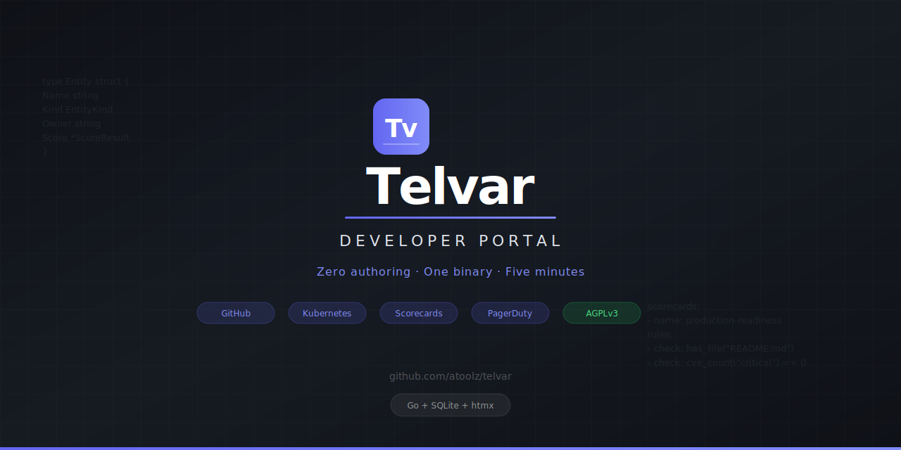

<p align="center">
  
</p>

<p align="center">
  <strong>Zero-authoring developer portal. One binary, zero YAML, five minutes.</strong>
</p>

<p align="center">
  <a href="https://github.com/atoolz/telvar/releases"></a>
  <a href="https://github.com/atoolz/telvar/blob/main/LICENSE"></a>
  <a href="https://github.com/atoolz/telvar"></a>
  
  
</p>

---

Telvar is a single Go binary that you point at your GitHub org and Kubernetes cluster to get a fully populated developer portal. No YAML to write, no plugins to install, no React to learn.

```bash
telvar serve --config telvar.yaml
```

It will:

1. **Scan every repo** in your GitHub org: detect language, framework, CI, CODEOWNERS, dependencies
2. **Infer what each repo is** (service, library, infrastructure) from existing files (Dockerfile, package.json, go.mod, helm/Chart.yaml)
3. **Pull from Kubernetes**: running deployments, versions, pods, resource usage
4. **Pull on-call data** from PagerDuty: who's on-call for each service right now
5. **Generate scorecards automatically**: has CI? has README? has CODEOWNERS? has CVEs? recent deploy?
6. **Render a web dashboard** with search, team pages, and inline docs

All in a ~20MB binary with embedded SQLite. No PostgreSQL, no Node.js, no build step.

## Why Telvar exists

[Backstage](https://backstage.io) (Spotify, 29k stars) is the dominant open-source developer portal. But:

- Takes **3-6 months** to set up
- Requires **2-5 dedicated platform engineers** to maintain
- Costs **~$150k/year** in engineering time for 20 developers
- Requires **React and TypeScript** expertise to customize
- **90% of adopters stall** at 10% internal adoption (Spotify's own data)

Backstage's complexity isn't a bug. It was built inside Spotify (2,000+ engineers, dedicated platform team) as an extensible framework, not a ready-to-use product. If you're not Spotify, you suffer.

Commercial alternatives (Port, Cortex, OpsLevel) solve the complexity but charge **$39-78/user/month**. For 100 engineers, that's $47k-94k/year.

**The gap**: between "free but takes 6 months" (Backstage) and "easy but costs $50k+/year" (SaaS), there is nothing. No simple open-source developer portal exists.

## How Telvar is different

| | Backstage | Port / Cortex (SaaS) | **Telvar** |
|---|---|---|---|
| Time to value | 3-6 months | 2-4 weeks | **5 minutes** |
| Staffing required | 2-5 platform engineers | 1 admin + vendor support | **0 (config file)** |
| Annual cost (200 devs) | ~$150k eng time | $47k-94k SaaS | **$0** |
| Data entry | Manual YAML per repo | Manual + partial discovery | **Full auto-discovery** |
| Extension model | React/TypeScript plugins | Vendor roadmap | **YAML config** |
| Deployment | Kubernetes + PostgreSQL | SaaS (no self-host) | **Single binary** |
| Self-hosted / air-gapped | Complex | No | **Yes** |

### Key differentiators

- **Zero authoring**: Backstage requires `catalog-info.yaml` in every repo. Telvar discovers everything from files that already exist in your repos.
- **Single binary + SQLite**: vs Backstage's Node.js + PostgreSQL + build pipeline + React plugins.
- **Config, not code**: customization via YAML config, not TypeScript plugins.
- **Go + htmx frontend**: server-rendered, no JavaScript build step. An architectural choice Backstage cannot replicate without a full rewrite.

## Quick start

```bash
# Download the binary
curl -fsSL https://github.com/atoolz/telvar/releases/latest/download/telvar-linux-amd64 -o telvar
chmod +x telvar

# Generate default config
./telvar config init

# Edit telvar.yaml with your GitHub org and token
# Then run discovery + start the server
./telvar serve
```

Or with Docker:

```bash
docker run -p 7007:7007 \
  -e GITHUB_TOKEN=ghp_xxx \
  -v telvar-data:/data \
  ghcr.io/atoolz/telvar:latest
```

Visit `http://localhost:7007` to see your catalog.

## Configuration

```yaml
server:
  port: 7007

connectors:
  github:
    org: your-org
    token: ${GITHUB_TOKEN}
  kubernetes:
    kubeconfig: ~/.kube/config
  pagerduty:
    api_key: ${PAGERDUTY_API_KEY}

discovery:
  scan_interval: 30m
  ignore_archived: true
  ignore_forks: true

scorecards:
  - name: production-readiness
    rules:
      - name: Has CI
        check: has_file(".github/workflows/*.yml")
        weight: 2
      - name: Has README
        check: has_file("README.md")
        weight: 1
      - name: Has CODEOWNERS
        check: has_file("CODEOWNERS")
        weight: 1
      - name: No Critical CVEs
        check: cve_count("critical") == 0
        weight: 3
```

## Tech stack

| Component | Choice | Why |
|---|---|---|
| Language | Go 1.25+ | Single binary, no runtime deps |
| Database | SQLite (pure Go, no CGO) | Zero ops, backup = copy one file |
| Frontend | Server-rendered HTML + htmx | No JS build step, no node_modules |
| Markdown | goldmark | GFM support, safe rendering |
| CLI | cobra | Standard Go CLI framework |

## What Telvar does NOT do

- Software templates / scaffolding
- Custom plugin system
- API catalog (OpenAPI rendering)
- Workflow automation
- Self-service actions
- SSO/SAML (use a reverse proxy like Authentik or Keycloak)

These are deliberate omissions, not missing features. Telvar does one thing well: show you what you have and how healthy it is.

## Roadmap

- [x] CLI foundation (serve, discover, config init)
- [x] Entity model with inference engine
- [x] SQLite store with FTS5 full-text search
- [x] GitHub org connector with concurrent discovery
- [x] Web UI with htmx (search, filter, detail pages)
- [x] Scorecard engine with YAML-defined rules
- [x] CVE checking via osv.dev (Go, npm, Python, Rust)
- [x] Docs viewer (render repo markdown with goldmark)
- [x] Kubernetes connector (deployment merge)
- [x] PagerDuty connector (on-call info)
- [x] Team pages with avg score and on-call
- [x] CI with golangci-lint + coverage
- [x] Release pipeline (5 cross-platform binaries + Docker GHCR)

## License

Telvar is licensed under the [GNU Affero General Public License v3.0](LICENSE) (AGPLv3).

**What this means:**
- You can use, modify, and self-host Telvar freely
- If you modify Telvar and provide it as a network service, you must share your modifications under AGPLv3
- You cannot build a proprietary SaaS on top of Telvar without releasing the source

### Commercial licensing

**Telvar Cloud** (planned) will offer managed hosting with enterprise features (multi-org, SAML/SSO, audit logging, scheduled reports, API access). Pricing: **flat monthly fee, not per-seat.**

## Contributing

Contributions are welcome. See [CONTRIBUTING.md](CONTRIBUTING.md) for guidelines.

---

<p align="center">
  Built by <a href="https://github.com/andreahlert">@andreahlert</a> as part of <a href="https://github.com/atoolz">AToolZ</a>
</p>
